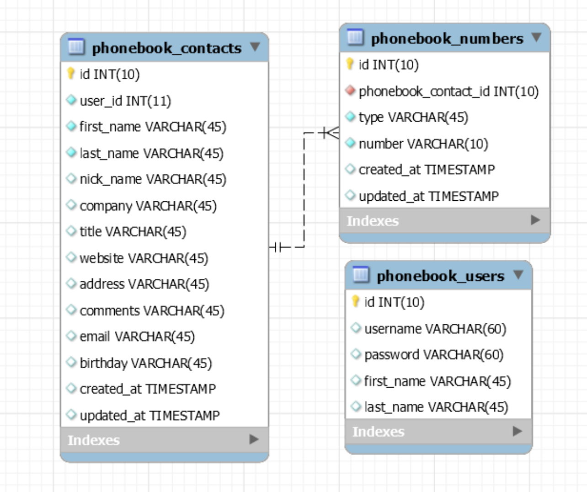

# Phonebook App

## Manual de uso y desarrollo
La aplicación desarrollada consistió en tres etapas principales: diseño, front-end, y back-end. En este documento se describirá cada etapa de desarrollo.

### Diseño
#### UI (User interface)
En cuestiones de UI se enfocó en una vista dirigida a una persona de negocios usando diferentes tonalidades de azules. Se utilizaron tarjetas de presentación para cada uno de los contactos en la agenda y se muestran diferentes elementos en dispositivos móviles y de escritorio.

#### UX (User experience)
Al finalizar las vistas de la aplicación se planeó utilizar un componente que no estuviera visible todo el tiempo, que consistiría como la información más detallada de cada contacto, la cual solo se mostrará al dar clic sobre cada tarjeta de contacto.

### Front-end
#### Clases
Se establecieron tres clases para el proyecto, las cuales se implementaron del lado del back-end en la base de datos también. **Users**: Los usuarios que pueden acceder a la aplicación, cada usuario cuenta con una agenda de contactos diferente. **Contacts**: Los contactos que son pertenecientes de un usuario, los cuales contienen toda la información como: nombre, domicilio, fecha de nacimiento, etc. Los contactos a su vez contienen números de teléfono los cuales pueden ser varios, diferentes, y de diferente tipo (móvil, hogar o de trabajo). **Phonenumber**: Esta clase almacena precisamente el tipo y el número de teléfono de cada contacto.

#### Servicios
Se crearon dos servicios para poder conectar la información mostrada en el front-end con la información almacenada en la base de datos. **User service**: El servicio de usuarios se creó con la intención de poder autenticarse en la aplicación y poder iniciar y cerrar sesión. Por cuestiones de tiempo se enfocó en simple autenticación, teniendo como trabajo futuro el registro de nuevos usuarios. **Contact service**: El servicio de contactos se utiliza para diferentes funciones como guardar o editar un contacto, eliminar un contacto, y poder obtener el listado de contactos desde la base de datos.

### Backend
#### Clases / Tablas
Al igual que en el front-end se crearon tres diferentes clases, con las mismas propiedades en cada una. Estas clases se almacenaron en tres tablas en la base de datos.

#### Relaciones BD
Se estableció una relación en las tablas de contactos con la de números (telefónicos), ya que un contacto puede tener varios números de teléfono, y cada número puede pertenecer a un solo contacto.

### Manual de uso
#### Login
La primera interfaz que se muestra en la aplicación es la de autenticación, en donde se tiene que ingresar el usuario y contraseña correspondiente para poder acceder a su lista de contactos.

#### Lista de contactos
Al ingresar a la lista de contactos se pueden observar varias tarjetas de presentación para cada contacto con información importante y los primeros dos números de teléfono. De la misma manera, en la parte superior se encuentra una barra de búsqueda para mayor facilidad al momento de querer encontrar un solo contacto, y al lado derecho de la barra de búsqueda es el botón para crear un nuevo contacto.

En la parte inferior de esta sección se puede encontrar la paginación de estas tarjetas de presentación.

Al dar clic sobre alguna de las tarjetas de presentación se habilitará la sección de edición en donde se mostrará toda la información del contacto.

#### Creación / Edición de contactos
La creación y edición de contactos son exactamente iguales, con la única diferencia de que en la edición de contactos, los campos de información se encuentran prellenados. En esta sección se le pide al usuario llenar obligatoriamente el nombre y apellido del contacto que desea guardar, así como un número de teléfono de 10 dígitos, el resto de la información es de manera opcional y puede dejarse en blanco.

#### Eliminación de contactos
Para poder eliminar un contacto de su agenda es necesario ingresar a la sección de edición, y navegar a la parte inferior, en donde se encuentra el botón :”Eliminar contacto”, un modal de confirmación aparecerá para confirmar la selección.

### Trabajos futuros
Como planeación para una segunda iteración del proyecto, se planea reemplazar la paginación, para obtener el listado de todos los contactos y mostrar el alfabeto de manera sticky en la parte superior.

Del mismo modo, se planea utilizar más la barra lateral izquierda, creando diferentes agendas en donde el usuario podrá seleccionar a cuál agenda (i.e. personal o de trabajo) desea almacenar un nuevo contacto.

Adicional a esto, se planea utilizar el círculo donde aparecen las iniciales de cada contacto para poder agregar una imagen (de manera opcional) a cada contacto.

Por último, se plantea la opción de poder compartir agendas con otros usuarios en donde en caso de tener una agenda compartida ambos usuarios podrán visualizar, editar, y eliminar contactos en dicha agenda.

## Development server

Run `ng serve` for a dev server. Navigate to `http://localhost:4200/`. The app will automatically reload if you change any of the source files.

## Build

Run `ng build` to build the project. The build artifacts will be stored in the `dist/` directory. Use the `--prod` flag for a production build.

## Further help

To get more help on the Angular CLI use `ng help` or go check out the [Angular CLI README](https://github.com/angular/angular-cli/blob/master/README.md).
